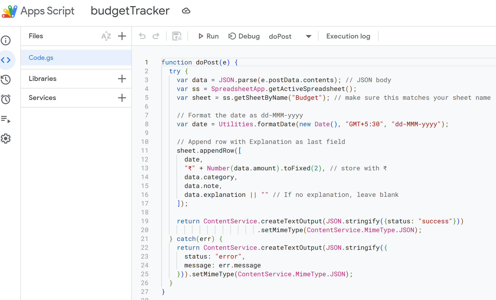
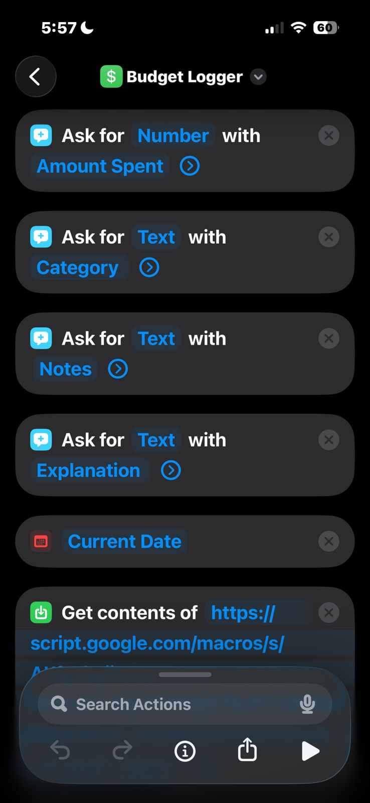
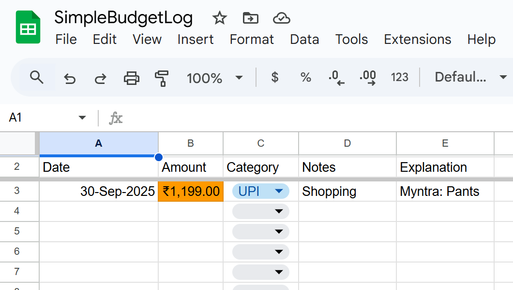

# iosToSheetsBudget

**Lightweight expense tracker:** iOS Shortcut → Google Apps Script → Google Sheets.  
Log expenses with a tap on your iPhone and get weekly summary emails automatically.

---

## 📁 Files

- `docs/` — screenshots and flow diagram images
- `Code.gs` — Apps Script (handles doPost, doGet, and sendWeeklySummary)  
- `shortcuts/Log Expense.shortcut.json` — iOS Shortcut JSON (importable)  
- `sheet-template.csv` — sample Google Sheet template  
- `LICENSE` — MIT license  

---

## ⚡ Quick Setup

### 1️⃣ Prepare the Google Sheet
1. Create a new Google Sheet.  
2. Name the tab **Budget** (or update `Code.gs` if you want a different name).  
3. Ensure the header row is exactly:
   
| Date | Amount | Category | Notes | Explanation|
|------|--------|----------|-------|------------|

5. Import `sheet-template.csv` if you want a ready-made header and example row.

**Example Sheet Preview:**

| Date      | Amount    | Category | Notes    | Explanation    |
|-----------|-----------|----------|--------- |----------------|
| 30-Sep-25 | ₹1,199.00 | UPI      | Shopping | Myntra: Pants  |

---

### 2️⃣ Set up Apps Script
1. Open **Extensions → Apps Script** in your sheet.  
2. Paste the contents of `Code.gs` and **Save**.  
3. Deploy as **Web App**:
   - Click **Deploy → New deployment → Web App**  
   - Execute as: **Me**  
   - Who has access: **Anyone**  
   - Copy the Web App URL.  

**Screenshot:**  


---

### 3️⃣ Set up iOS Shortcut
1. Import `shortcuts/Log Expense.shortcut.json` in the Shortcuts app.  
2. Edit the shortcut and replace `<YOUR_WEB_APP_URL>` with your Web App URL.  
3. Add the shortcut to your home screen for one-tap logging.  

**Screenshot:**  


---

### 4️⃣ Test it
- Run the shortcut on your iPhone.  
- Fill in **Amount**, **Category**, **Notes**, and **Explanation**.  
- Check your Google Sheet — the row should appear instantly.

**Screenshot:**  


---

### 5️⃣ Weekly summary email
1. In Apps Script editor → click **Triggers** (clock icon).  
2. Add a new trigger:
   - Function: `sendWeeklySummary`  
   - Event source: **Time-driven** → **Week timer** → pick day/time  

You’ll now receive a weekly email summarizing your expenses by payment method and category.

---

## 🔄 Flow Diagram

```text
iPhone Shortcut
      │
      ▼
Google Apps Script Web App (doPost)
      │
      ▼
Google Sheet "Budget"
      │
      ▼
sendWeeklySummary (triggered weekly)
      │
      ▼
Weekly Summary Email
```
---

## 🛠 Notes & Troubleshooting

1. No POST data received: Make sure the Shortcut sends JSON with header Content-Type: application/json.
2. Sheet not found: Confirm the tab name in the spreadsheet matches the name in Code.gs.
3. Change timezone: Update "GMT+5:30" in Code.gs to your timezone.
